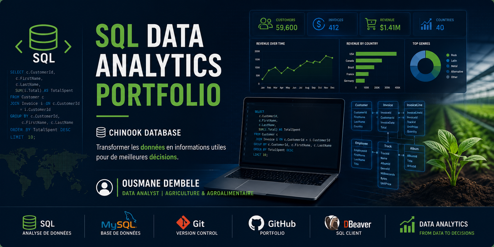
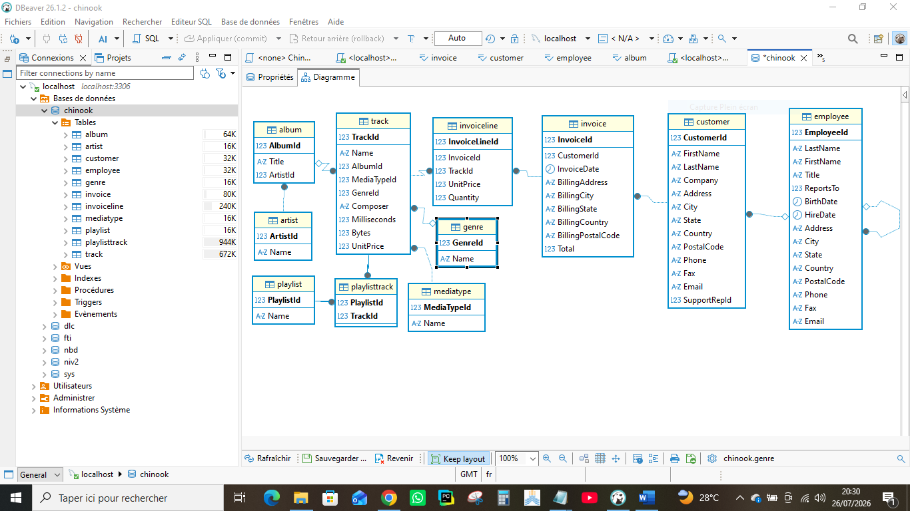
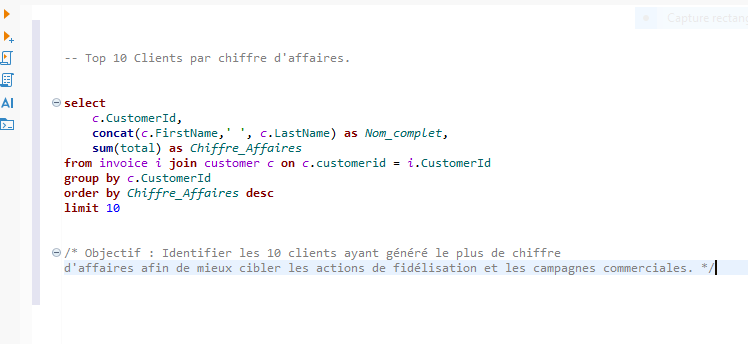
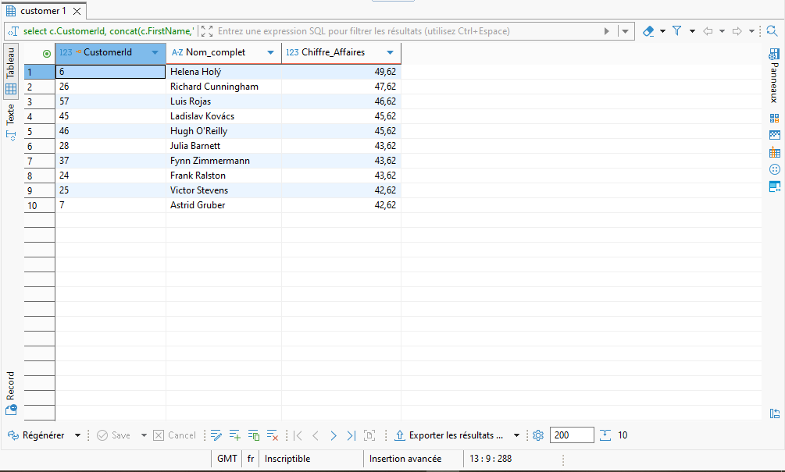
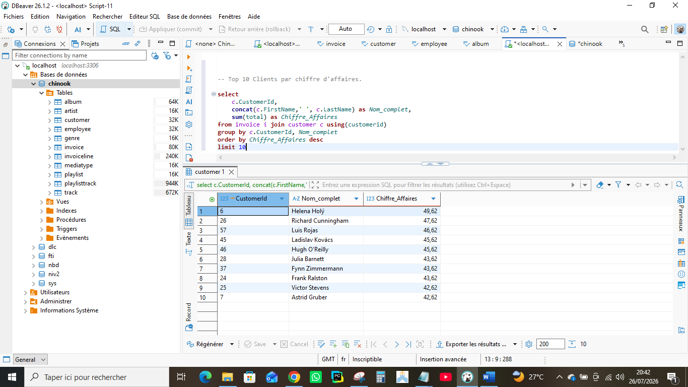
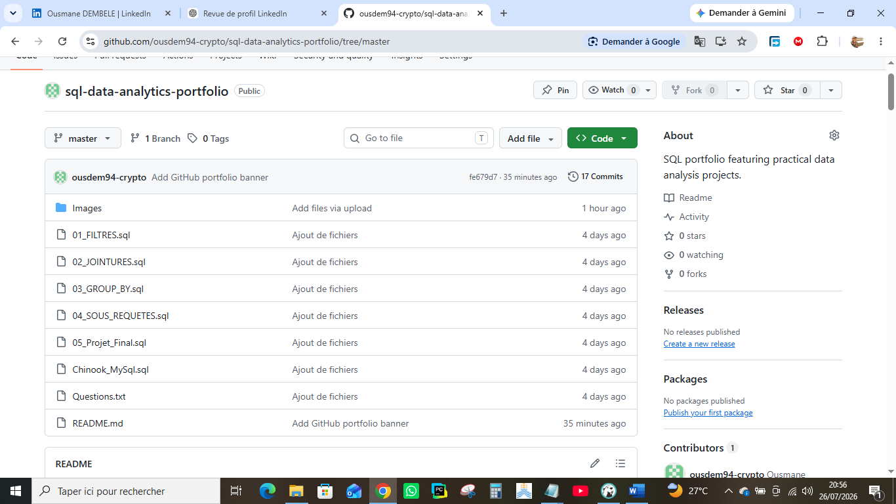

<p align="center">
  
</p>

# 📊 SQL Data Analytics Portfolio – Chinook Database


## 📑 Table des matières

- [👋 À propos du projet](#-à-propos-du-projet)
- [🌱 Pourquoi ce projet ?](#-pourquoi-ce-projet-)
- [🎯 Objectifs du projet](#-objectifs-du-projet)
- [📂 Structure du projet](#-structure-du-projet)
- [📚 Modules réalisés](#-modules-réalisés)
- [🧠 Compétences SQL développées](#-compétences-sql-développées)
- [🛠️ Technologies utilisées](#️-technologies-utilisées)
- [📈 Compétences acquises](#-compétences-acquises)
- [📊 Résultats du projet](#-résultats-du-projet)
- [🚀 Prochaines évolutions](#-prochaines-évolutions)
- [👨‍💻 À propos de moi](#-à-propos-de-moi)
- [📫 Me contacter](#-me-contacter)

> Un portfolio SQL conçu pour développer et démontrer des compétences en analyse de données à partir de la base de données **Chinook**.

---

## 👋 À propos du projet

Bienvenue dans mon premier portfolio SQL !

Ce dépôt regroupe une série d'exercices et de mini-projets réalisés dans le cadre de mon parcours vers le métier de **Data Analyst**.

Les requêtes sont construites à partir de la base de données **Chinook**, une base relationnelle simulant une plateforme de vente de musique en ligne.

L'objectif est de mettre en pratique les principales techniques SQL utilisées dans l'analyse de données et la Business Intelligence.

---

🌱 Pourquoi ce projet ?

Je suis convaincu que les données permettent de mieux comprendre les problèmes et de prendre de meilleures décisions. Issu du domaine de l'agriculture et de l'agroalimentaire, je développe progressivement mes compétences en Data Analytics afin de contribuer à l'amélioration des performances des organisations grâce aux données.

---

## 🗺️ Feuille de route du portfolio

Ce dépôt constitue la première étape de mon portfolio de Data Analytics.

| Projet | Statut |
|---------|:------:|
| SQL – Chinook Database | ✅ |
| SQL – Analyse avancée | 🔄 |
| Excel – Analyse commerciale | ⏳ |
| Power BI – Dashboard | ⏳ |
| Python – Analyse exploratoire | ⏳ |
| Agriculture & Agroalimentaire Analytics | ⏳ |

---

# 🎯 Objectifs du projet

Ce projet m'a permis de développer des compétences essentielles en SQL, notamment :

- Comprendre la structure d'une base de données relationnelle.
- Écrire des requêtes SQL claires et performantes.
- Manipuler, filtrer et nettoyer les données.
- Réaliser des analyses métier.
- Utiliser les fonctions d'agrégation.
- Maîtriser les jointures entre plusieurs tables.
- Résoudre des problématiques réelles grâce aux données.

---

# 📂 Structure du projet

```
sql-data-analytics-portfolio
│
├── Images
│   ├── sql-data-analytics-banner.png
│   ├── 01-chinook-schema.PNG
│   ├── 02-sql-query-top-customers.PNG
│   ├── 03-sql-results-top-customers.PNG
│   ├── 04-dbeaver-workspace.PNG
│   └── 05-github-project-structure.PNG
│
├── 01_FILTRES.sql
├── 02_JOINTURES.sql
├── 03_GROUP_BY.sql
├── 04_SOUS_REQUETES.sql
├── 05_Projet_Final.sql
├── Chinook_MySql.sql
├── Questions.txt
└── README.md
```

---

# 📸 Démonstration du projet

## 🗂️ Schéma de la base Chinook

La base de données Chinook est composée de plusieurs tables relationnelles représentant les clients, les factures, les artistes, les albums et les morceaux.

<p align="center">
  
</p>

---

## 💻 Exemple d'analyse SQL

### Question métier

> Quels sont les 10 clients ayant généré le plus grand chiffre d'affaires ?

### Requête SQL

<p align="center">
  
</p>

### Résultat obtenu

<p align="center">
  
</p>

### Analyse

Cette analyse met en évidence les clients générant le plus de chiffre d'affaires. Elle illustre comment SQL peut être utilisé pour répondre à une problématique métier concrète et fournir des informations utiles à la prise de décision, notamment pour les actions commerciales et les stratégies de fidélisation.

---

## 🛠️ Environnement de développement

Toutes les requêtes SQL ont été développées et testées avec DBeaver connecté à une base MySQL.

<p align="center">
  
</p>

---

## 📁 Organisation du projet

Le dépôt GitHub est organisé par modules afin de faciliter la lecture, la progression pédagogique et la réutilisation des requêtes.

<p align="center">
  
</p>

---

# 📚 Modules réalisés

| Module | Description | Statut |
|---------|-------------|:------:|
| 01 - Filtres | WHERE, ORDER BY, LIMIT, DISTINCT | ✅ |
| 02 - Jointures | INNER JOIN, LEFT JOIN, RIGHT JOIN | ✅ |
| 03 - GROUP BY | GROUP BY, HAVING, fonctions d'agrégation | ✅ |
| 04 - Sous-requêtes | Sous-requêtes simples et corrélées | ✅ |
| 05 - Projet final | Analyse de données et problématiques métier | ✅ |

---

# 🧠 Compétences SQL développées

## Requêtes SQL

- SELECT
- DISTINCT
- WHERE
- ORDER BY
- LIMIT

## Fonctions d'agrégation

- COUNT()
- SUM()
- AVG()
- MIN()
- MAX()

## Analyse de données

- GROUP BY
- HAVING
- Alias
- Fonctions de dates
- Sous-requêtes

## Jointures

- INNER JOIN
- LEFT JOIN
- RIGHT JOIN

---

# 🛠️ Technologies utilisées

| Outil | Utilisation |
|--------|-------------|
| MySQL | Base de données relationnelle |
| DBeaver | Exécution des requêtes SQL |
| Git | Gestion des versions |
| GitHub | Hébergement du projet |

---

# 📈 Compétences acquises

Grâce à ce projet, j'ai renforcé mes compétences en :

- Analyse de données relationnelles
- Manipulation de bases de données SQL
- Écriture de requêtes complexes
- Résolution de problématiques métier
- Organisation d'un projet technique
- Documentation de code
- Utilisation de Git et GitHub

---

## 📊 Résultats du projet

À travers ce projet, j'ai réalisé :

- ✅ Plus de 60 requêtes SQL.
- ✅ 5 modules progressifs couvrant les principales notions du langage SQL.
- ✅ Des analyses basées sur des problématiques métiers.
- ✅ Un projet final mobilisant plusieurs concepts SQL.
- ✅ Une documentation complète du projet sur GitHub.

---

# 🎓 Contexte d'apprentissage

Ce projet fait partie de mon parcours de formation vers le métier de **Data Analyst**.

Chaque exercice a été réalisé afin de construire progressivement un portfolio professionnel démontrant mes compétences en SQL et en analyse de données.

Ce dépôt sera régulièrement enrichi avec de nouveaux projets et des analyses plus avancées.

---

# 🚀 Prochaines évolutions

Les prochaines versions de ce portfolio intégreront notamment :

- Analyse avancée des ventes
- Fonctions analytiques (Window Functions)
- Création de vues SQL
- Optimisation des requêtes
- Dashboards Power BI
- Études de cas orientées Agriculture & Agroalimentaire

---

# 👨‍💻 À propos de moi

Je m'appelle **Ousmane DEMBELE**.

Je développe actuellement mes compétences en **SQL**, **Excel**, **Power BI** et **Data Analytics**, avec une spécialisation dans les domaines de **l'Agriculture** et de **l'Agroalimentaire**.

Mon objectif est d'aider les entreprises à transformer leurs données en informations utiles pour améliorer leur prise de décision.

---

## 📫 Me contacter

💼 **LinkedIn** :
https://www.linkedin.com/in/ousmane-dembele-16381b290/

💻 **GitHub** :
https://github.com/ousdem94-crypto

---

⭐ Merci d'avoir pris le temps de consulter ce projet !
---

> *"Chaque projet est une nouvelle opportunité d'apprendre, d'analyser et de transformer les données en décisions."*

— Ousmane DEMBELE

N'hésite pas à laisser une étoile ⭐ si ce dépôt t'a été utile ou intéressant.
